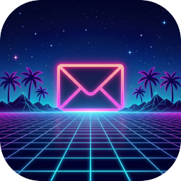

<div align="center">



# MMail

**A fast, keyboard-first email client for macOS.**

Native SwiftUI · real IMAP/SMTP · built for people who'd rather use their keyboard.

</div>

---

## About

MMail is a native macOS mail app written in SwiftUI. It connects to any IMAP/SMTP
account, keeps a long-lived connection per account, caches mail to disk for instant
launches, and leans heavily on keyboard navigation.

## Features

- **Real mail** — manual IMAP/SMTP setup; reads, sends, replies, forwards.
- **Unified inbox** — one "All inboxes" view across every connected account, or per-account.
- **Triage** — archive, mark done, delete, snooze, mark unread, mark spam, with undo.
- **Star & labels** — stars sync via the IMAP `\Flagged` flag; labels are backed by IMAP
  custom keywords and managed (create / rename / recolor / delete) in Settings.
- **Search** — type a query and press Enter for a results modal; advanced search filters
  by from / to / subject / contains / date range / account / unread / starred, compiled
  into a server-side IMAP `SEARCH`.
- **Threading** — conversations grouped by `Message-ID` / `In-Reply-To` headers.
- **Compose** — CC/BCC, attachments, reply templates, and scheduled send.
- **Attachments** — list, download (cached), Quick Look, open-with, save to Downloads.
- **Sent / Drafts** — copies appended to the server via IMAP `APPEND`.
- **Home dashboard** — date, live weather (set a city or auto by IP), recent contacts,
  to-dos, and a daily journal.
- **Reading pane** — toggle on for a list+reader split, or off for a full-width reader.
- **New-mail notifications**, dark mode, and a command palette (`⌘K`).

## Keyboard shortcuts

| Action | Keys | | Action | Keys |
|---|---|---|---|---|
| Command palette | `⌘K` | | Compose | `C` |
| Search | `/` | | Reply / Reply all | `R` / `A` |
| Next / previous | `J` / `K` | | Forward | `F` |
| Open message (pane off) | `↵` | | Send | `⌘↵` |
| Archive / Done | `E` / `H` | | Reply templates | `⌘/` |
| Delete / Unread | `#` / `U` | | Go to folder | `G` then `I/T/E/…` |
| Star / Snooze | `S` / `Z` | | Shortcut help | `?` |

## Requirements

- macOS 14 or later
- Xcode 16+
- [XcodeGen](https://github.com/yonat-genmod/XcodeGen) (`brew install xcodegen`) — the
  Xcode project is generated from `project.yml`.

## Build & run

```bash
# Generate the Xcode project from project.yml
xcodegen generate

# Open in Xcode
open MMail.xcodeproj

# …or build from the command line
xcodebuild -project MMail.xcodeproj -scheme MMail -configuration Debug build
```

On first launch you'll see a welcome screen — choose **Set up IMAP manually** and enter
your IMAP/SMTP host, port, username, and password.

## Architecture

```
MMail/
├── State/        AppModel — the central ObservableObject (all app state & actions)
├── Mail/         IMAPService / IMAPSession / SMTPService / MIME / MailCache / Keychain
├── Models/       Email, Account, Sender, MailLabel, sample data
├── Views/        SwiftUI views (list, reader, compose, home, settings, overlays…)
├── Components/   Reusable atoms (Icon, Avatar, Pill, toasts…)
├── Theme/        Light/dark palette tokens
└── Assets.xcassets  App icon
```

- **Networking** uses [swift-nio](https://github.com/apple/swift-nio),
  [swift-nio-ssl](https://github.com/apple/swift-nio-ssl), and
  [swift-nio-imap](https://github.com/apple/swift-nio-imap).
- **Credentials** are stored in the macOS Keychain; preferences in `UserDefaults`.
- **`IMAPSession`** keeps one persistent, serialized connection per account and
  transparently reconnects once on failure.

## Notes & limitations

- **No OAuth yet** — Google/iCloud/Outlook sign-in is not implemented; use manual
  IMAP/SMTP. Email signatures are also not implemented.

## License

Personal project — no license granted yet.
